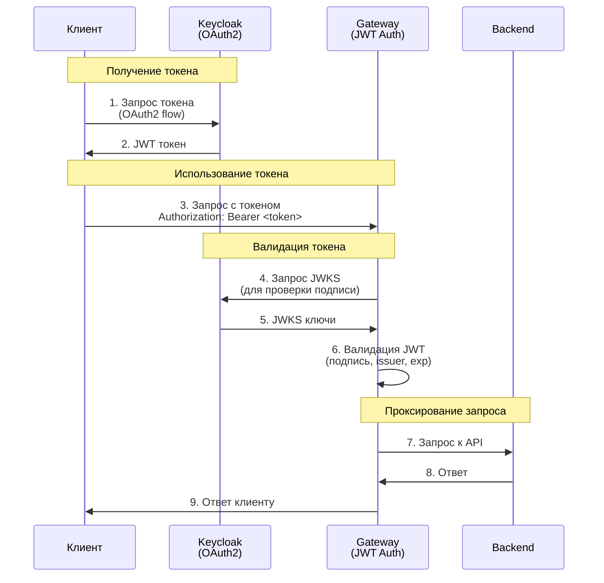

# Agentgateway JWT Authentication

Helm chart для настройки JWT аутентификации в agentgateway через AgentgatewayPolicy.

## Описание

Этот chart создает `AgentgatewayPolicy` ресурс, который настраивает JWT аутентификацию для Gateway в agentgateway.

## Конфигурация

### Режимы аутентификации

- `Strict` - требует валидный JWT для всех запросов (по умолчанию)
- `Optional` - валидирует JWT если он предоставлен, но разрешает запросы без токена
- `Permissive` - никогда не отклоняет запросы, даже с невалидными токенами

### Провайдеры JWT

Chart поддерживает настройку одного или нескольких провайдеров JWT. Каждый провайдер должен иметь:

- `issuer` - URL издателя токенов (должен совпадать с `iss` claim в JWT)
- `audiences` - список разрешенных аудиторий (опционально)
- `jwks.remote` - конфигурация для получения JWKS с удаленного сервера
  - `jwksPath` - путь к JWKS endpoint
  - `cacheDuration` - время кеширования ключей
  - `backendRef` - ссылка на Kubernetes сервис

### Пример получения токена

После настройки Keycloak, можно получить токен:

```bash
# Получить endpoint Keycloak
KEYCLOAK_URL="http://keycloak.keycloak.svc.cluster.local:8080"
KEYCLOAK_CLIENT="your-client-id"
KEYCLOAK_SECRET="your-client-secret"

# Получить токен
ACCESS_TOKEN=$(curl -s -X POST "${KEYCLOAK_URL}/realms/master/protocol/openid-connect/token" \
  -H "Content-Type: application/x-www-form-urlencoded" \
  -d "grant_type=password" \
  -d "client_id=${KEYCLOAK_CLIENT}" \
  -d "client_secret=${KEYCLOAK_SECRET}" \
  -d "username=user1" \
  -d "password=password" \
  | jq -r '.access_token')

# Использовать токен в запросе
curl -H "Authorization: Bearer ${ACCESS_TOKEN}" http://your-gateway/your-path
```

## Использование с OAuth2

Текущая конфигурация поддерживает OAuth2 через валидацию JWT токенов. Схема работы:

### Простая схема OAuth2 Flow



### Как это работает

1. **Клиент получает токен через OAuth2** у Keycloak (Authorization Code Flow, Client Credentials, Password Grant и т.д.)
2. **Клиент отправляет запрос** к Gateway с токеном в заголовке `Authorization: Bearer <token>`
3. **Gateway валидирует JWT токен**:
   - Проверяет подпись через JWKS endpoint Keycloak
   - Проверяет issuer (должен совпадать с `issuer` в конфигурации)
   - Проверяет audiences (если указаны)
   - Проверяет срок действия токена
4. **Если токен валиден** - запрос проходит к backend
5. **Если токен невалиден или отсутствует** - возвращается 401 (в режиме `Strict`)

### Пример OAuth2 Authorization Code Flow

Для веб-приложений используйте стандартный OAuth2 Authorization Code Flow:

```javascript
// 1. Перенаправление пользователя на Keycloak
const authUrl = `${KEYCLOAK_URL}/realms/master/protocol/openid-connect/auth?` +
  `client_id=${CLIENT_ID}&` +
  `redirect_uri=${REDIRECT_URI}&` +
  `response_type=code&` +
  `scope=openid`;

// 2. После авторизации Keycloak вернет code в redirect_uri
// 3. Обмен code на токен
const tokenResponse = await fetch(`${KEYCLOAK_URL}/realms/master/protocol/openid-connect/token`, {
  method: 'POST',
  headers: { 'Content-Type': 'application/x-www-form-urlencoded' },
  body: new URLSearchParams({
    grant_type: 'authorization_code',
    client_id: CLIENT_ID,
    client_secret: CLIENT_SECRET,
    code: authorizationCode,
    redirect_uri: REDIRECT_URI
  })
});

const { access_token } = await tokenResponse.json();

// 4. Использование токена в запросах к Gateway
fetch('http://your-gateway/your-path', {
  headers: {
    'Authorization': `Bearer ${access_token}`
  }
});
```

### Текущая конфигурация

Текущая конфигурация в `values.yaml` уже настроена для работы с OAuth2:

- **Issuer**: Keycloak realm (должен совпадать с `iss` claim в JWT)
- **JWKS**: Автоматическое получение ключей для валидации подписи
- **Режим**: `Strict` - требует валидный токен для всех запросов

Для автоматического редиректа на Keycloak при отсутствии токена потребуется дополнительная настройка External Authorization (см. документацию agentgateway).

## Проверка работы

1. Запрос без токена должен вернуть 401:

```bash
curl -v http://your-gateway/your-path
```

1. Запрос с валидным токеном должен вернуть 200:

```bash
curl -v -H "Authorization: Bearer ${ACCESS_TOKEN}" http://your-gateway/your-path
```

## Множественные провайдеры

Для настройки нескольких провайдеров JWT, добавьте их в `values.yaml`:

```yaml
jwtAuth:
  policy:
    providers:
      - issuer: "http://keycloak.keycloak.svc.cluster.local:8080/realms/master"
        audiences: ["my-application"]
        jwks:
          remote:
            jwksPath: "/realms/master/protocol/openid-connect/certs"
            backendRef:
              name: keycloak
              namespace: keycloak
              port: 8080
      - issuer: "https://auth0.example.com/"
        audiences: ["my-other-application"]
        jwks:
          remote:
            jwksPath: "/.well-known/jwks.json"
            backendRef:
              name: auth0-proxy
              namespace: auth-system
              port: 443
```
